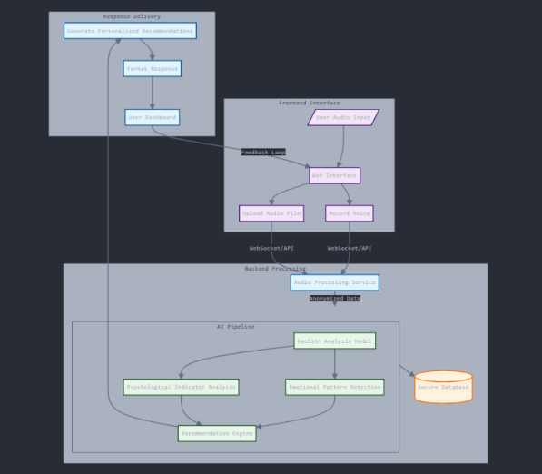

# Ai-Dio-Help

Team->
Yashwanth S K
Harshil Bisarya
team 50


# Audio Emotion Analyzer with AI-based Therapeutic Responses

This project leverages AI models to analyze emotions from audio input and provide therapeutic responses, similar to interactions with a therapist. It integrates emotion recognition from speech with empathetic, AI-driven responses, designed to offer support and emotional insights to users.

## Key Components

### 1. **Brief Introduction**
The system analyzes audio files to detect the emotional state of the speaker and generates therapeutic feedback. It consists of two main modules:
- **Emotion Recognition**: Detects emotions such as happy, sad, angry, neutral, etc., from spoken audio.
- **AI-driven Therapeutic Responses**: Provides empathetic, supportive responses based on the recognized emotions, similar to a therapist's approach.

### 2. **Workflow Diagram**



1. **User Uploads Audio**: The user uploads an audio file (e.g., voice note) to the front-end.
2. **Audio Processing**: The audio file is sent to the backend where emotion recognition is performed using a trained model.
3. **Emotion Detection**: The detected emotions (e.g., happy, sad) are used to generate therapeutic responses.
4. **AI Response**: The system generates and returns a therapeutic message based on the detected emotion.
5. **User Feedback**: The user receives a response in real-time.

### 3. **Concept Map**


- **Emotion Recognition** -> **Emotion Detected (e.g., Happy, Sad, Angry)** -> **Therapeutic AI Response**
- **Audio Input** -> **Speech Emotion Recognition Model** -> **AI-Driven Chatbot for Response**

### 4. **Tech Stack**
- **Backend**: 
  - **Node.js** (for server-side functionality)
  - **Express.js** (for handling API requests)
  - **Multer** (for file uploads)
  - **node-fetch** (for forwarding audio to the Python backend)
  
- **Python Backend**: 
  - **Flask** (for creating the Python server)
  - **Librosa** (for audio feature extraction)
  - **Soundfile** (for saving and handling audio files)
  
- **Machine Learning Models**:
  - **Speech Emotion Recognition (SER)**: fine-tuned model on emotion datasets (RAVDESS, IEMOCAP)
  - **Therapeutic AI**: Fine-tuned Llama 2/3 models for generating therapeutic, empathetic responses

- **Deployment**: Local environment or cloud-based deployment for production use.

### 5. **Novelty**
The integration of emotion recognition and AI-driven therapy responses provides a unique combination of both technical and psychological elements. The system allows users to receive real-time, empathetic feedback based on their emotional state, offering potential for use in mental health support applications, voice assistants, and other domains requiring emotional intelligence.

### 6. **Solution**
The solution consists of:
- A backend that processes audio input to detect emotions.
- An AI system that generates therapeutic responses based on the detected emotions.
- A real-time interaction model where users can upload audio, receive emotion detection, and get feedback instantly.

This solution can be used in various applications such as:
- Mental health support systems
- Voice-based assistants with emotional intelligence
- Personal well-being and therapy applications

### 7. **Others**

- **Future Improvements**:
  - Expand emotional detection to more complex states (e.g., anxious, frustrated).
  - Include multilingual support for various languages.
  - Enhance the chatbot with more sophisticated therapeutic responses.

### Installation

#### How to run

```bash
git clone https://github.com/Yashwanth-S-K/MindHackers-50-SUSTAIN-AI-THON.git
cd MindHackers-50-SUSTAIN-AI-THON
#in terminal 1
node server.js 

#in terminal 2 ~ assuming you have the models
python model-services.py
python audio_processor.py

